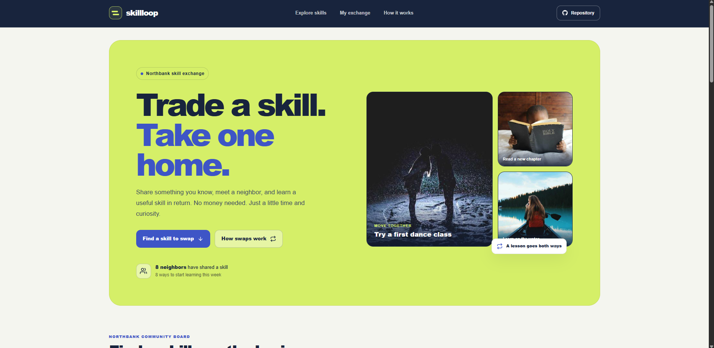



# Skillloop

Skillloop is a community board for neighbors who want to share a practical skill and learn one in return. The project is being built as a responsive React app with a local demo dataset and GitHub Pages deployment.

## Run locally

```sh
npm install
npm run dev
```

## Checks and deployment

```sh
npm run lint
npm run build
npm run deploy
```

The deploy command builds the app and publishes the contents of `dist` to the `gh-pages` branch.

## Future improvements

Ideas that are not implemented yet:

- Add sign-in and server-backed member accounts.
- Add real messaging and scheduling for skill swaps.
- Add accessibility and content moderation tools for community organizers.

## Links

- Portfolio: [https://www.ashishranjan.net](https://www.ashishranjan.net)
- GitHub: [https://github.com/a2rp](https://github.com/a2rp)
- CodePen: [https://codepen.io/ash1198](https://codepen.io/ash1198)
- LinkedIn: [https://www.linkedin.com/in/aashishranjan](https://www.linkedin.com/in/aashishranjan)
- Facebook: [https://www.facebook.com/theash.ashish/](https://www.facebook.com/theash.ashish/)
- YouTube: [https://www.youtube.com/@ashishranjan-ashz?sub_confirmation=1](https://www.youtube.com/@ashishranjan-ashz?sub_confirmation=1)
- Email: [mailto:ash.ranjan09@gmail.com](mailto:ash.ranjan09@gmail.com)

## Support

- Support: [https://a2rp-donation-page.netlify.app/](https://a2rp-donation-page.netlify.app/)
- Buy Me a Coffee: [https://buymeacoffee.com/ashishranjan](https://buymeacoffee.com/ashishranjan)
- Patreon: [https://www.patreon.com/ashishranjan](https://www.patreon.com/ashishranjan)
